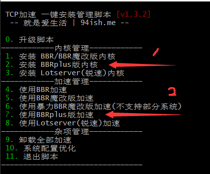

# ssr_tools
* ssr_tools项目主要内容：
    * 科学上网ssrmu.sh的辅助脚本
    * ssr客户端软件及使用教程（Wiki）
    * 使用ssrmu.sh脚本在VPS上快速地搭建ssr服务，实现科学上网
    
-----------------------------------

## 科学上网简要教程

* 安装ssr服务器很简单，分三步：先买服务器，一般5$的服务器就够用了；然后安装ssr服务端；最后再加速，就可以用了，都很简单，有不懂的可以提issues。

### 购买服务器

1. 首先你需要拥有一台VPS服务器，商家很多，自行选择购买。此处推荐vultr，理由是这家即使IP被墙也能随时删除重新换机器，以免发生刚买了一年IP就被墙了这种尴尬的事。官网：<https://www.vultr.com/> 
2. VPS服务器选择CentOS6+ / Debian6+ / Ubuntu14+

### 安装shadowsocksR

1. 远程登陆到VPS服务器，执行以下命令：

   ~~wget -N --no-check-certificate https://raw.githubusercontent.com/ToyoDAdoubi/doubi/master/ssrmu.sh && chmod +x ssrmu.sh && bash ssrmu.sh~~
   ```bash
   wget -N --no-check-certificate https://github.com/ZhangQi1996/ssr_tools/tree/master/ssrmu.sh && chmod +x ssrmu.sh && bash ssrmu.sh 
   ```
   
2. 脚本执行后，输入1，回车，开始安装shadowsocksR；接下来根据自己的情况输入即可，不想看的，可以按我的顺序无脑来：

   ```
   显示IP：默认 （直接回车）
   用户名：admin
   端口：1234
   密码：password
   加密方式：10
   协议插件：1
   混淆插件：1
   下面的限制视情况而定，可以直接回车默认
   
   开始安装后，中途会提示输入y，输入y并回车即可，然后等待安装结束。
   ```

   当弹出用户配置信息界面后，即成功安装shadowsocksR。然后进行加速即可使用。
3. 目前为止已经完成了ssr的配置，并启动（默认就是开机自启动的），为了提高体验度最好安装加速模块

### 加速

1. ~~更换服务器内核（会重启）：~~
    * ~~wget --no-check-certificate https://blog.asuhu.com/sh/ruisu.sh && bash ruisu.sh~~
    * ~~服务器断开连接后，等待1，2分钟后重连。~~

2. ~~安装锐速：~~
    * ~~wget -N --no-check-certificate https://raw.githubusercontent.com/91yun/serverspeeder/master/serverspeeder-all.sh && bash serverspeeder-all.sh~~
    * ~~当命令执行结束，并且有[Running Status]ServerSpeeder is running!时，说明加速成功。~~
3. 1,2两条可能由于云服务器基于不同的虚拟化技术，可能导致替换内核后无法连接网络的问题，现更新网络加速部分
    1. 下载配置
        ```
        # 最好在root下执行，键入
        # 若显示没有wget，则(centos) yum install -y wget, (ubuntu) apt-get install -y wget
        wget -N --no-check-certificate "https://raw.githubusercontent.com/chiakge/Linux-NetSpeed/master/tcp.sh" && chmod +x tcp.sh && ./tcp.sh
        ```
    2. 显示的界面
    
        

        0. 通过iptables -L -n命令查看当前的防火墙策略，截图下来包含你所设置的ssr通信端口的防火墙信息
        1. 输入2安装bbrplus plus内核，这个过程需要一段时间，然后会提醒你是否需要重启，输入y
        2. 会断开ssh连接，等待一段时间，再次连接上去。
        3. 再次执行那个脚本(bash tcp.sh)，输入7便完成了配置，会提示你bbrplus plus启动成功
        4. reboot等一会再登陆ssh
        5. 验证你的bbrplus是否成功
            ```
            A. 验证当前TCP控制算法的命令：

                sysctl net.ipv4.tcp_available_congestion_control 
                
                返回值一般为：
                     net.ipv4.tcp_available_congestion_control = bbrplus cubic reno
                或者为：
                     net.ipv4.tcp_available_congestion_control = reno cubic bbrplus

            B，验证BBR是否已经启动。
            
                sysctl net.ipv4.tcp_congestion_control 
                
                返回值一般为：
                   net.ipv4.tcp_congestion_control = bbrplus
                
                lsmod | grep bbrplus 
                
                返回值有 tcp_bbrplus 模块即说明 bbrplus 已启动。注意：并不是所有的 VPS 都会有此返回值，若没有也属正常。
            ```
        6. 由于更换内核，原本的防火墙策略可能已被删除，查看iptables -L -n看，若已被清除，则根据之前步骤0的截图通过iptables命令重新注入到iptables中
    3. 已经完成加速部分的安装使用了
    
### 使用SSR

* ssr服务器搭建好后，客户端使用方法：<https://gitee.com/ChiZhung/ssr_client_guide/wikis>

### 其他

* 服务器搭建好后，可以使用以下辅助脚本。
    1. 为ssr批量创建用户
        * <https://github.com/ZhangQi1996/ssr_tools/tree/master/create_account>
    2. 为ssr批量删除用户
        * <https://github.com/ZhangQi1996/ssr_tools/tree/master/delete_account>
    3. 为ssr产生特定用户的二维码
        * <https://github.com/ZhangQi1996/ssr_tools/tree/master/generate_qr>